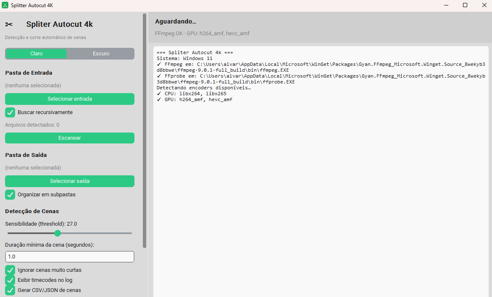

# AutoScene Splitter 4K

Aplicativo desktop (Windows/macOS/Linux) que detecta automaticamente os cortes de cena em vídeos e exporta cada cena como um arquivo separado, preservando a qualidade máxima (incluindo 4K).



## Recursos

- Detecção automática de cenas com [PySceneDetect](https://scenedetect.com/) (`ContentDetector`)
- Processamento em lote de uma pasta inteira, com busca recursiva opcional
- Exportação de cada cena via FFmpeg, com tentativa de *stream copy* (rápido, sem perda) e fallback automático para reencode preciso quando necessário
- Detecção automática de encoders de GPU disponíveis (NVIDIA NVENC, Intel QSV, AMD AMF) com fallback seguro para CPU (libx264/libx265)
- Três modos de exportação: Automático, Rápido (GPU) e Máxima Qualidade (CPU)
- Alternância de tema claro/escuro na interface (padrão: claro)
- Organização automática das cenas exportadas em subpastas por vídeo
- Geração opcional de metadados das cenas em CSV e JSON (início, fim e duração)
- Log em tempo real e barra de progresso, com opção de cancelar o processamento
- Interface gráfica moderna com [customtkinter](https://github.com/TomSchimansky/CustomTkinter)

## Requisitos

- Python 3.10+
- [FFmpeg e FFprobe](https://www.gyan.dev/ffmpeg/builds/) instalados e disponíveis no `PATH`
- Dependências Python:
  - `customtkinter`
  - `scenedetect[opencv]`

## Instalação

### 1. Dependências Python

```bash
pip install customtkinter "scenedetect[opencv]"
```

### 2. FFmpeg

**Windows**
```powershell
winget install Gyan.FFmpeg
```
Ou baixe manualmente em https://www.gyan.dev/ffmpeg/builds/ (release full build), extraia e adicione a pasta `bin` ao `PATH` do sistema. Após instalar, reabra o terminal (ou o VSCode inteiro) para que o novo `PATH` seja reconhecido.

**macOS**
```bash
brew install ffmpeg
```

**Linux (Debian/Ubuntu)**
```bash
sudo apt install ffmpeg
```

Verifique a instalação com:
```bash
ffmpeg -version
```

## Uso

```bash
python main.py
```

1. Selecione a **pasta de entrada** com os vídeos (busca recursiva opcional) e clique em **Escanear** para conferir quantos arquivos foram detectados.
2. Selecione a **pasta de saída** onde as cenas cortadas serão salvas.
3. Ajuste os parâmetros de **detecção de cenas**:
   - **Sensibilidade (threshold)**: quanto menor, mais sensível a mudanças de cena (mais cortes)
   - **Duração mínima da cena**: cenas mais curtas que isso são ignoradas
4. Configure a **exportação**:
   - **Modo**: Automático, Rápido (GPU) ou Máxima Qualidade (CPU)
   - **GPU/Encoder preferido**: Auto, CPU, NVIDIA, Intel ou AMD
   - **Forçar reencode**: desativa o corte rápido por stream copy, garantindo cortes mais precisos (porém mais lentos)
5. Clique em **INICIAR PROCESSAMENTO**. Acompanhe o log e a barra de progresso; é possível **cancelar** a qualquer momento.
6. Ao final, use **Abrir pasta de saída** para acessar os arquivos gerados.

### Formatos de vídeo suportados na entrada

`.mp4`, `.mkv`, `.mov`, `.avi`, `.webm`, `.m4v`, `.flv`, `.wmv`, `.mpg`, `.mpeg`, `.ts`

### Saída

Para cada vídeo `nome.ext`, são gerados (em `saida/nome/` se "Organizar em subpastas" estiver ativo):

- `nome_Scene_001.mp4`, `nome_Scene_002.mp4`, ...
- `nome_scenes.csv` e `nome_scenes.json` (se "Gerar CSV/JSON de cenas" estiver ativo)

## Solução de problemas

- **"FFmpeg NÃO encontrado no PATH"**: instale o FFmpeg (veja acima) e reinicie o terminal/VSCode por completo para que o `PATH` atualizado seja carregado.
- **GPU não detectada**: o app testa cada encoder de fato (não só lista); se o driver/hardware não suportar o encoder, ele cai automaticamente para CPU.
- **Corte impreciso**: ative "Forçar reencode" para garantir cortes exatos, ao custo de tempo de processamento maior.
